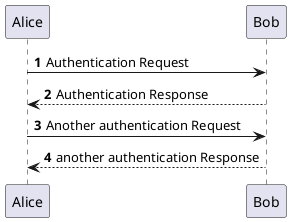
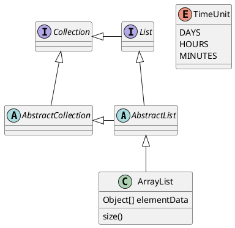

# github workflow testing

```plantuml
@startuml
'https://plantuml.com/sequence-diagram

autonumber

Alice -> Bob: Authentication Request
Bob --> Alice: Authentication Response

Alice -> Bob: Another authentication Request
Alice <-- Bob: another authentication Response
@enduml
```

```plantuml
@startuml
'https://plantuml.com/class-diagram

abstract class AbstractList
abstract AbstractCollection
interface List
interface Collection

List <|-- AbstractList
Collection <|-- AbstractCollection

Collection <|- List
AbstractCollection <|- AbstractList
AbstractList <|-- ArrayList

class ArrayList {
Object[] elementData
size()
}

enum TimeUnit {
DAYS
HOURS
MINUTES
}

@enduml
```